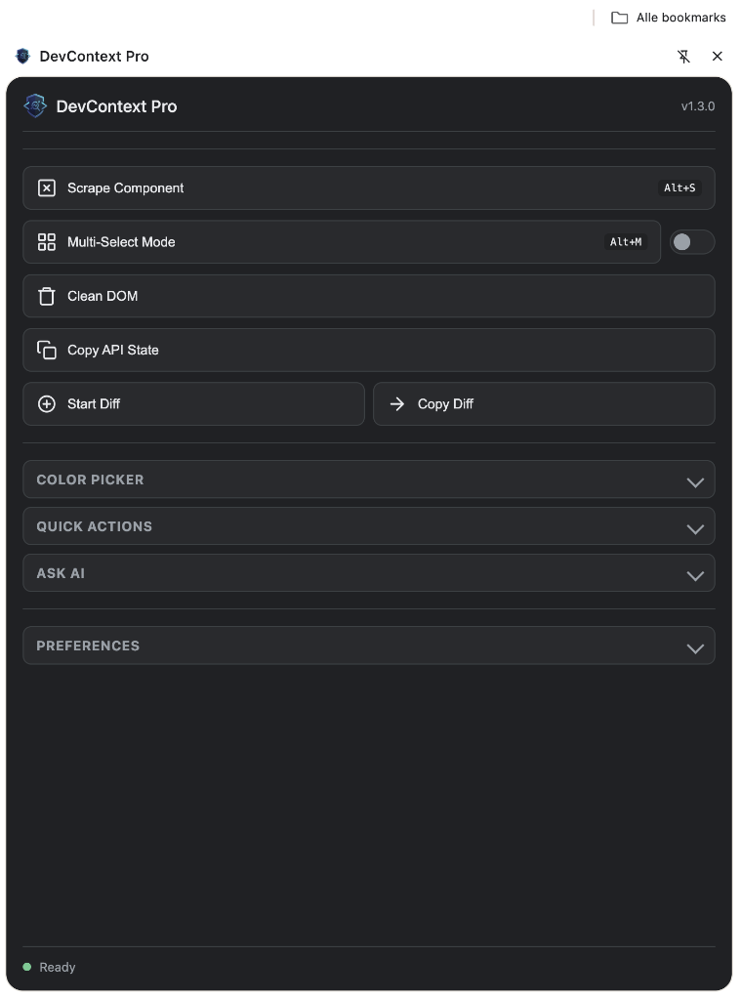

# DevContext Pro

> Premium Chrome Extensie voor het extraheren van schone DOM-context en componentstructuren

## 🎯 Overzicht

DevContext Pro is een professionele ontwikkelaarstool ontworpen om het proces van het extraheren van HTML-componenten, het opschonen van DOM-structuren en het vastleggen van API-state van webpagina's te stroomlijnen. Gebouwd met Manifest V3, biedt het een premium, glassmorphic interface met krachtige extractiemogelijkheden.

## ✨ Functionaliteiten

### 🔍 Scrape Component
- Interactieve element-selector met visuele overlay
- Klik op een element om de HTML-structuur te extraheren
- Slimme formattering met juiste inspringing
- Eén-klik kopiëren naar klembord

### 🧹 Clean DOM
- Verwijdert onnodige scripts, styles en SVG-paden
- Stript HTML-commentaren
- Geoptimaliseerd voor AI-context (klaar voor Gemini)
- Configureerbare opschoonvoorkeuren

### 📊 Copy API State
- Extraheer localStorage en sessionStorage
- Leg cookies en window-variabelen vast
- Geformatteerd als markdown voor eenvoudig delen
- Perfect voor debugging en documentatie

## 🚀 Installatie

### Vanuit de broncode

1. Clone of download deze repository
2. Open Chrome en ga naar `chrome://extensions/`
3. Schakel "Developer mode" in rechtsboven
4. Klik op "Load unpacked"
5. Selecteer de `devcontext-pro` map

## 💎 Gebruik

1. Klik op het DevContext Pro-pictogram in je Chrome-werkbalk
2. Kies je gewenste actie:
   - **Scrape Component**: Klik om te activeren, klik vervolgens op een element op de pagina
   - **Clean DOM**: Kopieer direct de volledig opgeschoonde paginastructuur
   - **Copy API State**: Extraheer alle API-gerelateerde state-informatie

### Voorkeuren

Configureer extractiegedrag:
- **Exclude Comments**: Verwijder HTML-commentaren uit de uitvoer
- **Auto-format for Gemini**: Formatteer uitvoer optimaal voor AI-verwerking
- **Remove Scripts & Styles**: Strip `<script>`, `<style>`, en inline stijlen

## 🏗️ Architectuur

```
devcontext-pro/
├── manifest.json          # Manifest V3 configuratie
├── icons/                 # Extensie pictogrammen (16, 32, 48, 128)
├── popup/                 # Extensie popup UI
│   ├── popup.html         # Premium Material Design 3 interface
│   ├── popup.css          # Glassmorphism styling
│   └── popup.js           # UI controller en event handling
└── scripts/
    ├── content.js         # Element selectie en DOM extractie
    ├── content.css        # Overlay en notificatie stijlen
    └── background.js      # Service worker voor verwerking
```

## 🎨 Design Filosofie

DevContext Pro biedt een premium gebruikerservaring met:
- **Dark Mode First**: Diep indigo (#1e1b4b) en leisteen grijs (#0f172a) palet
- **Glassmorphism**: Matglaseffecten met subtiele transparantie
- **Vloeiende Animaties**: Micro-interacties voor verbeterde UX
- **Material Design 3**: Moderne, professionele interfacecomponenten

## 🔐 Machtigingen

- `activeTab`: Toegang tot het huidige actieve tabblad voor elementselectie
- `storage`: Gebruikersvoorkeuren opslaan
- `scripting`: Injecteer content scripts voor DOM-manipulatie

## 🛠️ Ontwikkeling

### Tech Stack
- Vanilla JavaScript (geen externe dependencies)
- Manifest V3 compliantie
- Lokale scripts (geen CDN's voor beveiliging)

### Belangrijkste Componenten

**PopupController** (`popup/popup.js`)
- Beheert UI-interacties
- Handelt opslag van voorkeuren af
- Communiceert met content scripts

**DevContextPro** (`scripts/content.js`)
- Elementselectie met visuele overlay
- DOM opschonen en HTML-extractie
- Functionaliteiten voor kopiëren naar klembord

**BackgroundService** (`scripts/background.js`)
- HTML naar Markdown conversie
- Tijdelijke gegevensopslag
- Afhandeling van complexe transformaties

## 📋 Roadmap

- [ ] Exporteren naar meerdere formaten (Markdown, JSON, XML)
- [ ] Custom CSS selector bouwer
- [ ] Geschiedenis van geëxtraheerde componenten
- [ ] Cloud sync voor voorkeuren
- [ ] Team samenwerkingsfuncties

## 🔧 Probleemoplossing

### Pictogrammen niet zichtbaar
Als je een plaatshouder "D" pictogram ziet in plaats van het logo:

1. **Verwijder de extensie volledig**
   - Ga naar `chrome://extensions/`
   - Klik op **Remove** (niet alleen uitschakelen)

2. **Herstart Chrome**
   - Sluit Chrome volledig af
   - Open Chrome opnieuw

3. **Herlaad de extensie**
   - Ga naar `chrome://extensions/`
   - Schakel **Developer mode** in
   - Klik op **Load unpacked**
   - Selecteer de extensiemap

De pictogrammen zouden nu correct moeten worden weergegeven in zowel de werkbalk als de extensiebeheerpagina.

## 📄 Licentie

Dit project wordt aangeboden zoals het is (as-is) voor ontwikkelingsdoeleinden.

## 🤝 Bijdragen

Dit is een project voor persoonlijk en professioneel gebruik. Voel je vrij om te forken en aan te passen aan je behoeften.

---

**Gebouwd met ❤️ voor ontwikkelaars die waarde hechten aan schone code en premium UX**
